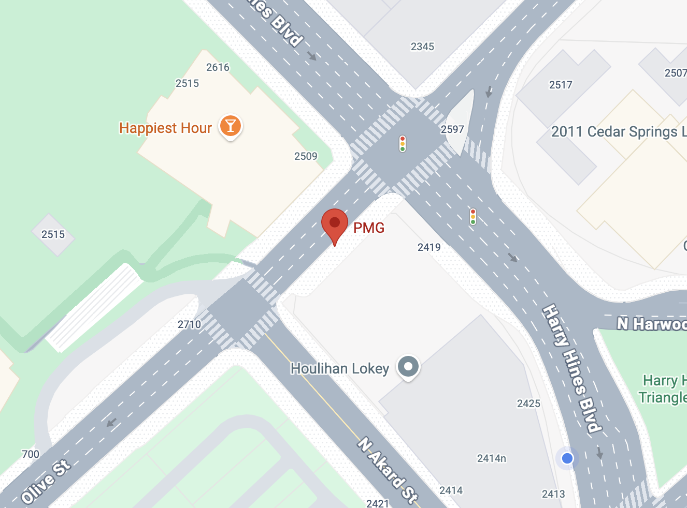

---
---
format:
  html:
    theme:
      - default
      - styles.scss
    toc: false
    smooth-scroll: true
    page-layout: full
    title-block: false
    embed-resources: true
    anchor-sections: false
    include-in-header:
      text: |
        <meta name="robots" content="noindex, nofollow">
---
---

```{=html}
<nav class="top-nav">
  <div class="nav-brand">
    
    <span>GLP Welcome Guide</span>
  </div>

  <div class="nav-links">
    <a href="#finding-a-place-to-live">Neighborhoods</a>
    <a href="#finding-an-apartment">Apartments</a>
    <a href="#parking-and-transportation">Transportation</a>
    <a href="#weather">Weather</a>
    <a href="#license">License</a>
    <a href="#pmger-recommendations">Recommendations</a>
    <a href="#helpful-resources">Resources</a>

    <button
      class="nav-search-toggle"
      id="nav-search-toggle"
      type="button"
      aria-label="Search guide"
      aria-expanded="false"
    >
      🔍
    </button>
  </div>
</nav>

<div class="nav-search-panel" id="nav-search-panel" hidden>
  <div class="nav-search-inner">
    <input
      id="nav-search-input"
      type="search"
      placeholder="Ask a question, like 'How do I register my car?'"
      autocomplete="off"
      aria-label="Search the Dallas guide"
    >

    <div
      id="nav-search-results"
      class="nav-search-results"
    ></div>
  </div>
</div>
```

```{=html}
<section class="welcome-hero">
  <div class="welcome-hero-inner">

    <div class="welcome-copy">

      <p class="welcome-kicker">
          
      </p>

      <h1>Welcome to Dallas Guide for Incoming GLPers</h1>

      <p class="welcome-intro">
        Welcome to the PMG Graduate Leadership Program! We’re so excited to welcome you to the team! Below you’ll find helpful information on apartment hunting, transportation, local resources, and recommendations from fellow PMGers!
      </p>

      <div class="welcome-meta">

        <div class="welcome-meta-item">
          <span class="welcome-meta-label">Office Address</span>
          <span class="welcome-meta-value">
            2601 Olive St<br>
            Floor 19 <br>
            Dallas, TX 75201
          </span>
        </div>

        <div class="welcome-meta-item">
          <span class="welcome-meta-label">Proj. Start Date</span>
          <span class="welcome-meta-value">
            Monday, June 7th, 2027
          </span>
        </div>

        <div class="welcome-meta-item">
          <span class="welcome-meta-label">Guide Topics</span>
          <span class="welcome-meta-value">
            Neighborhoods<br>
            Apartments<br>
            Transportation<br>
            Weather<br>
            Driver's License & Registration<br>
            PMGer Recommendations<br>
            Helpful Resources
          </span>
        </div>

      </div>

    </div>

    <div class="welcome-map">
  <a
    href="https://www.google.com/maps/search/?api=1&query=2601+Olive+St+Dallas+TX+75201"
    target="_blank"
    rel="noopener noreferrer"
    aria-label="Open PMG Dallas office in Google Maps"
  >
    
  </a>
</div>
</section>
```

::: {.section-light}

# Finding a Place to Live

Finding an apartment in Dallas is fairly straightforward, but prices, incentives, and utility costs can vary significantly between neighborhoods and buildings. The information below covers where to search, common move-in specials, electricity, parking, and the fees you'll likely encounter before signing a lease.

## Selecting the Right Neighborhoods {#neighborhood-options}

Choosing where to live can have a major impact on your commute, budget, and day-to-day experience in Dallas. The neighborhoods below are popular starting points for incoming GLPers.

## Local Options
```{=html}
<div class="neighborhood-grid">

  <article class="neighborhood-card">
    <h3>📍 Uptown</h3>

    <div class="neighborhood-meta">
      <span class="commute">🚶   Walk to PMG</span>
    </div>

    <div class="tags">
      <span>Nightlife</span>
      <span>Katy Trail</span>
      <span>Walkable</span>
    </div>

    <p>
      Walkable to the office, McKinney Avenue trolley, Katy Trail, and nightlife.
      The most popular choice for new GLPers.
    </p>

    <div class="rent">$2,400–$2,800+</div>

    <a href="https://www.google.com/search?q=uptown+dallas" target="_blank">
      View on Google Maps →
    </a>
  </article>

  <article class="neighborhood-card">
    <h3>📍 Knox–Henderson</h3>

    <div class="neighborhood-meta">
      <span class="commute">🚗   10 min</span>
    </div>

    <div class="tags">
      <span>Restaurants</span>
      <span>Shopping</span>
      <span>Patios</span>
    </div>

    <p>
      Trendy shopping and dining near Highland Park and SMU.
      Great option for client dinners and weekends.
    </p>

    <div class="rent">~$1,800</div>

    <a href="https://www.google.com/search?q=knox+henderson+dallas" target="_blank">
      View on Google Maps →
    </a>
  </article>

  <article class="neighborhood-card">
    <h3>📍 Oak Lawn</h3>

    <div class="neighborhood-meta">
      <span class="commute">🚗   8 min</span>
    </div>

    <div class="tags">
      <span>Katy Trail</span>
      <span>Turtle Creek</span>
      <span>Residential</span>
    </div>

    <p>
      Quiet residential neighborhood with quick access to Uptown,
      Love Field and the Medical District.
    </p>

    <div class="rent">$1,900–$2,200</div>

    <a href="https://www.google.com/search?q=oak+lawn+dallas" target="_blank">
      View on Google Maps →
    </a>
  </article>

  <article class="neighborhood-card">
    <h3>📍 Deep Ellum</h3>

    <div class="neighborhood-meta">
      <span class="commute">🚗   10 min</span>
    </div>

    <div class="tags">
      <span>Live Music</span>
      <span>Nightlife</span>
      <span>Arts</span>
    </div>

    <p>
      Known for murals, live music, breweries and one of the best nightlife
      scenes in Dallas.
    </p>

    <div class="rent">~$1,950</div>

    <a href="https://www.google.com/search?q=deep+ellum+dallas" target="_blank">
      View on Google Maps →
    </a>
  </article>

  <article class="neighborhood-card">
    <h3>📍 Bishop Arts</h3>

    <div class="neighborhood-meta">
      <span class="commute">🚗   15 min</span>
    </div>

    <div class="tags">
      <span>Coffee</span>
      <span>Restaurants</span>
      <span>Local Shops</span>
    </div>

    <p>
      Historic Oak Cliff neighborhood with independent restaurants,
      boutiques and a relaxed atmosphere.
    </p>

    <div class="rent">$1,300–$1,500</div>

    <a href="https://www.google.com/search?q=bishop+arts+dallas" target="_blank">
      View on Google Maps →
    </a>
  </article>

  <article class="neighborhood-card">
    <h3>📍 Lower Greenville</h3>

    <div class="neighborhood-meta">
      <span class="commute">🚗   12 min</span>
    </div>

    <div class="tags">
      <span>Bars</span>
      <span>Restaurants</span>
      <span>Young Professionals</span>
    </div>

    <p>
      A favorite among young professionals with a lively restaurant and bar
      scene close to Uptown.
    </p>

    <div class="rent">~$1,700</div>

    <a href="https://www.google.com/search?q=lower+greenville+dallas" target="_blank">
      View on Google Maps →
    </a>
  </article>

</div>
```

## Suburban Options {#suburban-options}
If you're comfortable with a longer commute, the suburbs offer lower rent, larger apartments, and plenty of dining, shopping, and entertainment. Many PMGers choose these areas to maximize space and value while staying within a reasonable drive of the Uptown office.
```{=html}
<div class="neighborhood-grid">

  <article class="neighborhood-card">
    <h3>📍 Richardson</h3>

    <div class="neighborhood-meta">
      <span class="commute">🚗 25–30 min</span>
    </div>

    <div class="tags">
      <span>Budget Friendly</span>
      <span>UT Dallas</span>
      <span>Quiet</span>
    </div>

    <p>
      A great value option with a quieter suburban feel. Close to UT Dallas
      and the Telecom Corridor, making it a popular choice for those wanting
      lower rent and more space.
    </p>

    <div class="rent">$1,300–$1,400</div>

    <a href="https://www.google.com/search?q=richardson+tx" target="_blank">
      View on Google Maps →
    </a>
  </article>

  <article class="neighborhood-card">
    <h3>📍 Addison</h3>

    <div class="neighborhood-meta">
      <span class="commute">🚗 20–25 min</span>
    </div>

    <div class="tags">
      <span>Restaurants</span>
      <span>Nightlife</span>
      <span>Central</span>
    </div>

    <p>
      Centrally located between Uptown, Plano, and Carrollton with one of the
      largest restaurant scenes in North Texas.
    </p>

    <div class="rent">$1,450–$1,550</div>

    <a href="https://www.google.com/search?q=addison+tx" target="_blank">
      View on Google Maps →
    </a>
  </article>

  <article class="neighborhood-card">
    <h3>📍 Plano</h3>

    <div class="neighborhood-meta">
      <span class="commute">🚗 30–35 min</span>
    </div>

    <div class="tags">
      <span>Corporate</span>
      <span>Legacy West</span>
      <span>Family Friendly</span>
    </div>

    <p>
      Home to Legacy West and several corporate headquarters. Offers newer
      apartments, excellent shopping, and a suburban lifestyle.
    </p>

    <div class="rent">$1,350–$1,450</div>

    <a href="https://www.google.com/search?q=plano+tx" target="_blank">
      View on Google Maps →
    </a>
  </article>

  <article class="neighborhood-card">
    <h3>📍 Frisco</h3>

    <div class="neighborhood-meta">
      <span class="commute">🚗 35–45 min</span>
    </div>

    <div class="tags">
      <span>New Apartments</span>
      <span>Sports</span>
      <span>Shopping</span>
    </div>

    <p>
      One of the fastest-growing cities in the country with modern apartment
      communities, retail, entertainment, and sports venues.
    </p>

    <div class="rent">$1,300–$1,400</div>

    <a href="https://www.google.com/search?q=frisco+tx" target="_blank">
      View on Google Maps →
    </a>
  </article>

  <article class="neighborhood-card">
    <h3>📍 Las Colinas</h3>

    <div class="neighborhood-meta">
      <span class="commute">🚗 20–25 min</span>
    </div>

    <div class="tags">
      <span>Airport Access</span>
      <span>Canals</span>
      <span>Corporate</span>
    </div>

    <p>
      Known for its canal walk, corporate campuses, and quick access to both
      DFW Airport and Uptown. A balanced option for work and travel.
    </p>

    <div class="rent">$1,550–$1,750</div>

    <a href="https://www.google.com/search?q=las+colinas+irving" target="_blank">
      View on Google Maps →
    </a>
  </article>

</div>
```

*Rough averages as of mid-2026. Rents vary by season, building, and current availability.*

::: {.callout-tip}
### **Rule of Thumb**
The closer you live to Uptown and McKinney Avenue, the higher the rent but the easier the commute. Richardson, Plano, and Frisco can cost less and offer more space, but they require a daily highway commute.
:::

:::
::: {.section-dark}

# Finding an Apartment 

From locating a unit to understanding your first bill, these are the main things that make Dallas apartment hunting different from other cities.

## Where to Search for Apartments {#apartment-search}

<div class="apartment-search-logos">

  <a
    href="https://www.apartments.com/"
    target="_blank"
    rel="noopener noreferrer"
    class="apartment-search-card"
  >
    
    <span>Apartments.com</span>
  </a>

  <a
    href="https://www.zillow.com/dallas-tx/apartments-1-bedrooms/"
    target="_blank"
    rel="noopener noreferrer"
    class="apartment-search-card"
  >
    
    <span>Zillow</span>
  </a>

  <a
    href="https://www.apartmentlist.com/tx/dallas"
    target="_blank"
    rel="noopener noreferrer"
    class="apartment-search-card"
  >
    
    <span>Apartment List</span>
  </a>

</div>

## PMG Recommendations for Housing {#housing-recommendations}
*Sample results from a fictional PMGer housing survey created for this guide.*

```{=html}
<div class="recommendations-grid apartment-recommendations-grid">

  <article class="recommendation-card">
    <h3>🏆 The Jordan by Windsor</h3>
    <p><strong>Neighborhood:</strong> Uptown</p>
    <p>Walkable to PMG, modern amenities, and easy access to Katy Trail.</p>
    <div class="tags">
      <span>12 Votes</span>
      <span>Walkable</span>
    </div>
  </article>

  <article class="recommendation-card">
    <h3>🥈 MAA Uptown Village</h3>
    <p><strong>Neighborhood:</strong> Uptown</p>
    <p>Great location, social atmosphere, and spacious floor plans.</p>
    <div class="tags">
      <span>10 Votes</span>
      <span>Popular</span>
    </div>
  </article>

  <article class="recommendation-card">
    <h3>🥉 Gables Park 17</h3>
    <p><strong>Neighborhood:</strong> Victory Park</p>
    <p>High-rise living with nearby restaurants and an easy commute.</p>
    <div class="tags">
      <span>9 Votes</span>
      <span>High-Rise</span>
    </div>
  </article>

  <article class="recommendation-card">
    <h3>The Taylor Uptown</h3>
    <p><strong>Neighborhood:</strong> Uptown</p>
    <p>Resort-style amenities and one of the shortest walks to the office.</p>
    <div class="tags">
      <span>8 Votes</span>
      <span>Amenities</span>
    </div>
  </article>

  <article class="recommendation-card">
    <h3>AMLI Design District</h3>
    <p><strong>Neighborhood:</strong> Design District</p>
    <p>Excellent value with newer units and convenient highway access.</p>
    <div class="tags">
      <span>7 Votes</span>
      <span>Value</span>
    </div>
  </article>

</div>
```

Tour in person when possible because quality can vary significantly within the same price range, especially in Uptown high-rises. A common starting guideline is to budget about 25–30% of income for rent.

::: {.callout-important}
Always ask about move-in specials before signing. Apartment locators may also know about unpublished specials or availability.
:::

::: {.section-light}
# Fees, Deposits, and Move-In Deals {#move-in-deals}

Winter, especially November through February, is generally the slowest leasing season and the best time to negotiate. Summer is peak demand and usually has fewer concessions. However, it's important to note the more common move-in deals that you may see during your apartment search process

## Deals on Housing

| Area or Property Type | Typical Deal Level | What to Expect |
|---|---|---|
| Uptown and New High-Rises | Biggest deals | One to two-and-a-half months of free rent may be available when buildings are competing to fill new units. |
| Frisco and Las Colinas | Biggest deals | Newer high-rise and mid-rise buildings often offer aggressive incentives. |
| Richardson, Addison, and Older Plano Properties | Smaller but still useful | Waived administrative fees or reduced deposits are more common than large rent concessions. |

## Apartment Fees {#apartment-fees}

Always ask for the **total effective monthly cost**, not only the advertised base rent.

| Fee | Typical Cost |
|---|---|
| Administrative Fee | $150–$300 |
| Application Fee | $50–$75 per person |
| Amenity or Valet Trash Fee | $20–$30 per month |
| Pet Rent | $20–$35 per month, plus deposit |
| RUBS Utility Billing | Shared water and trash charges |
| Security Deposit |
| Garage Parking | $100–$200 per month (depends) |


:::{.callout-important}
Always ask about move-in specials before signing. Apartment locators may also know about unpublished specials or availability.
:::
:::

::: {.section-dark}

# Electricity {#electricity}

Texas has a deregulated electricity market. Use [PowerToChoose.org](https://www.powertochoose.org/){target="_blank"}, the official Public Utility Commission of Texas comparison site, to compare plans by ZIP code.

- Start with a fixed-rate 12-month plan for more predictable billing.
- Compare the all-in rate at 1,000 kWh, not only the advertised teaser rate.
- Oncor delivers the electricity and reads the meter regardless of which retail provider you select.
- Air conditioning may run almost continuously during summer, so budget for higher electric bills from June through September.
:::
::: {.section-light}

# Parking and Transportation {#parking-and-transportation}

Uptown high-rises commonly charge **$100–$200 per month** for a reserved garage space, although some properties include surface parking. Suburban complexes in Plano, Frisco, and Richardson are more likely to include parking at no extra cost. 


However, previous GLP classes have emphasized the need to make sure whether the parking is inside the apartment complex or not!

## Driving Through Dallas {#driving-through-dallas}

Dallas is primarily a driving city built around highways and tollways. Plan for traffic, toll costs, and commute variability.

### Major Highways

```{=html}
<div class="highway-grid">

  <article class="highway-card">
    <div class="highway-card-header">
      <h4>US-75 / Central Expressway</h4>
    </div>

    <div class="highway-columns">
      <div class="highway-pros">
        <strong>Pros</strong>
        <ul>
          <li>Direct route through Uptown to Richardson and Plano</li>
          <li>Many DART stations are located along the corridor</li>
        </ul>
      </div>

      <div class="highway-cons">
        <strong>Cons</strong>
        <ul>
          <li>Frequently congested throughout the day</li>
          <li>Narrow lanes and recurring construction can cause delays</li>
        </ul>
      </div>
    </div>
  </article>

  <article class="highway-card">
    <div class="highway-card-header">
      <h4>I-35E / Stemmons Freeway</h4>
    </div>

    <div class="highway-columns">
      <div class="highway-pros">
        <strong>Pros</strong>
        <ul>
          <li>Direct connection toward Las Colinas, Irving, and Fort Worth</li>
        </ul>
      </div>

      <div class="highway-cons">
        <strong>Cons</strong>
        <ul>
          <li>Heavy freight traffic</li>
          <li>Frequent backups near the Design District and Mockingbird Lane</li>
        </ul>
      </div>
    </div>
  </article>

  <article class="highway-card">
    <div class="highway-card-header">
      <h4>I-635 / LBJ Freeway</h4>
    </div>

    <div class="highway-columns">
      <div class="highway-pros">
        <strong>Pros</strong>
        <ul>
          <li>Managed TEXpress toll lanes can remain faster during rush hour</li>
        </ul>
      </div>

      <div class="highway-cons">
        <strong>Cons</strong>
        <ul>
          <li>Free lanes are often congested</li>
          <li>Toll-lane costs can add up</li>
        </ul>
      </div>
    </div>
  </article>

  <article class="highway-card">
    <div class="highway-card-header">
      <h4>Dallas North Tollway</h4>
    </div>

    <div class="highway-columns">
      <div class="highway-pros">
        <strong>Pros</strong>
        <ul>
          <li>Usually the fastest route north to Addison, Plano, Frisco, and the Legacy area</li>
          <li>Often more reliable than US-75 during rush hour</li>
        </ul>
      </div>

      <div class="highway-cons">
        <strong>Cons</strong>
        <ul>
          <li>It is a toll road</li>
          <li>Daily commuting costs can accumulate quickly</li>
        </ul>
      </div>
    </div>
  </article>

</div>
```

::: {.callout-tip}
# **Transportation Rule of Thumb**
US-75 is the route most associated with unpredictable congestion. The Dallas North Tollway is often more reliable but costs money via Toll Tag.
:::

::: {.section-dark} 

# DART and TollTag {#dart-tolltag}

The Dallas–Fort Worth area offers two primary ways to get around: DART for public transportation and the NTTA TollTag for driving on toll roads.

* **DART (Dallas Area Rapid Transit)**: DFW's public transportation system, providing light rail, buses, streetcars, and GoLink on-demand services throughout DFW; utilizes the GoPass app; convenient option for commuting without a car.

* **NTTA TollTag**: Free electronic toll collection sticker issued by the North Texas Tollway Authority; allows drivers to pay tolls automatically on participating toll roads without stopping; typically provides lower toll rates than paying by mail.

| Item | Cost | Notes |
|---|---:|---|
| DART (Three Hour Pass) | $3.00 | Valid for 2.5 hours. Purchase through the GoPass app. |
| DART (Day Pass) | $6.00 | Unlimited rides on rail, buses, and GoLink for the day. Confirm current pricing in the app. |
| NTTA TollTag | Free | Used for cashless tollways, including the DNT, President George Bush Turnpike, DFW Air and SH-161. It can also be used for parking at the DFW Airport. |


### Airports {#airports}

```{=html}
<div class="airport-grid">

  <article class="airport-card">
  <h4>DFW International Airport</h4>
  <p><strong>Best for:</strong> International travel, widest selection of flights</p>
  <p><strong>Drive from Uptown:</strong> Approximately 25–40 minutes</p>
  <p><strong>Airline strength:</strong> Major American Airlines hub</p>
  <p><strong>Flight mix:</strong> International and domestic</p>
</article>

  <article class="airport-card">
  <h4>Dallas Love Field</h4>

  <p><strong>Best for:</strong> Quick domestic trips and convenience</p>
  <p><strong>Drive from Uptown:</strong> Approximately 10–15 minutes</p>
  <p><strong>Airline strength:</strong> Southwest Airlines' home base</p>
  <p><strong>Flight mix:</strong> Mostly domestic and short-haul</p>
</article>

</div>
```
:::

::: {.section-light}

## Weather in Texas {#weather}

<div class="weather-grid">

<div class="weather-card weather-summer">

### Summer

<div class="weather-highlight">

95–105°F

</div>

Hot and humid from roughly June through September. Air conditioning runs nearly nonstop, and electricity bills can rise substantially.

</div>

<div class="weather-card weather-fall">

### Fall

<div class="weather-highlight">

Best Weather

</div>

October and November usually bring warm days, cooler nights, and lower humidity. Generally the most pleasant time of year.

</div>

<div class="weather-card weather-winter">

### Winter

<div class="weather-highlight">

40s–60s°F

</div>

Usually mild but unpredictable. Ice storms or hard freezes can shut down roads and schools. Keep a coat and blanket in your car.

</div>

<div class="weather-card weather-spring">

### Spring

<div class="weather-highlight">

Storm Season

</div>

Spring is beautiful but volatile. Severe thunderstorms and tornadoes are possible, so keep weather alerts enabled.

</div>

</div>
:::

::: {.section-dark}

# Driver's License {#license}

Texas gives new residents firm deadlines. The recommended order is vehicle inspection, registration, insurance verification, and then the Texas driver's license.

### Within 30 Days

#### Register Your Vehicle {#vehicle-registration}

Register your vehicle at the county tax assessor-collector's office. Uptown residents will generally use Dallas County. Bring:

- Out-of-state title
- Proof of insurance that meets Texas minimums
- Photo identification

You must register the vehicle before applying for a Texas driver's license.

#### Complete an Emissions Inspection {#emissions-inspection}

Dallas County requires an annual emissions inspection before registration. Texas eliminated the general safety inspection requirement in 2025, but emissions testing still applies in Dallas and several other DFW-area counties.

### Within 90 Days

#### Getting a Texas Driver's License {#texas-drivers-license}

Apply through the Texas Department of Public Safety. Bring:

- Proof of identity
- Social Security number
- Two proofs of Texas residency

:::

::: {.section-light}
# Optional

#### Register to Vote {#register-to-vote}

You may register when obtaining a Texas ID or through the appropriate state registration process.

### Texas Minimum Auto Liability Coverage {#auto-insurance}

| Coverage | Minimum |
|---|---:|
| Bodily injury per person | $30,000 |
| Bodily injury per accident | $60,000 |
| Property damage | $25,000 |

This is commonly summarized as **30/60/25**. Confirm that your out-of-state policy meets these minimums before registering your vehicle.

:::

::: {.section-dark}

# PMGer Recommendations {#pmger-recommendations}

Pulled straight from a PMG survey — the spots and tips real coworkers actually use.

<div class="recommendations-intro">
  <p>
    Browse recommendations by category below. These are loaded directly from
    recommendations.csv.
  </p>
</div>

<div id="recommendations-status" class="recommendations-status">
  Loading recommendations...
</div>

<div id="recommendations-container" class="recommendations-grid"></div>

<div class="recommendations-actions">
  <button
    id="show-all-recommendations"
    class="recommendations-button"
    type="button"
    hidden
    aria-expanded="false"
    aria-controls="all-recommendations">
    View All Recommendations
  </button>
</div>

<div id="all-recommendations" hidden></div>

<script src="https://cdn.jsdelivr.net/npm/papaparse@5.5.3/papaparse.min.js"></script>
<script src="recommendations.js"></script>

:::

::: {.section-light}

# Helpful Resources {#helpful-resources}
<div class="resource-list">
  <a class="resource-item" href="https://www.powertochoose.org/" target="_blank" rel="noopener noreferrer">
    <span class="resource-icon">⚡</span>
    <span>
      <strong>PowerToChoose</strong>
      <small>Official electricity-plan comparison site</small>
    </span>
    <span class="resource-arrow">→</span>
  </a>

  <a class="resource-item" href="https://www.ntta.org/" target="_blank" rel="noopener noreferrer">
    <span class="resource-icon">🚗</span>
    <span>
      <strong>NTTA TollTag</strong>
      <small>TollTag registration and account management</small>
    </span>
    <span class="resource-arrow">→</span>
  </a>

  <a class="resource-item" href="https://www.dart.org/" target="_blank" rel="noopener noreferrer">
    <span class="resource-icon">🚊</span>
    <span>
      <strong>DART</strong>
      <small>Fares, routes, rail, buses, and GoPass</small>
    </span>
    <span class="resource-arrow">→</span>
  </a>

  <a class="resource-item" href="https://www.dps.texas.gov/" target="_blank" rel="noopener noreferrer">
    <span class="resource-icon">🪪</span>
    <span>
      <strong>Texas DPS</strong>
      <small>Driver's license information and appointments</small>
    </span>
    <span class="resource-arrow">→</span>
  </a>
</div>
:::

::: {.section-dark}

# Final Checklist {#checklist}
## PMG Pre-Engagement {#pmg-pre-engagement}

- [ ] Ask the P&C Team for additional onboarding recommendations
- [ ] Review PMGer apartment and neighborhood suggestions
- [ ] Confirm first-day office details
- [ ] Save important PMG contacts

## Your First Week in Dallas {#setup-checklist}

### Before Move-In
- [ ] Set Up Electricity
- [ ] Purchase Renter's Insurance
- [ ] Confirm Parking and Move-In Instructions

### First Few Days
- [ ] Set up your TollTag
- [ ] Download GoPass
- [ ] Test Your Commute to the PMG office
- [ ] Locate Your Nearest Grocery Store, Pharmacy, and Gas Station

### First Month
- Complete emissions inspection if required
- Register your vehicle
- Begin the Texas driver's license process

```{=html}
<script>
  document.querySelectorAll('input[type="checkbox"]').forEach(function(box) {
    var key = 'dallas-guide-' + box.parentElement.textContent.trim();
    box.checked = localStorage.getItem(key) === 'true';
    box.addEventListener('change', function() {
      localStorage.setItem(key, box.checked);
    });
  });
</script>
```
<script>
document.addEventListener("DOMContentLoaded", function () {

  const toggle = document.getElementById("nav-search-toggle");
  const panel = document.getElementById("nav-search-panel");
  const input = document.getElementById("nav-search-input");
  const results = document.getElementById("nav-search-results");

  if (!toggle || !panel || !input || !results) return;

  const sections = [
    {
      id: "neighborhood-options",
      title: "Dallas Neighborhoods",
      terms: [
        "where should i live",
        "best neighborhood",
        "neighborhood",
        "uptown",
        "walk to work",
        "walk to pmg",
        "close to office",
        "rent by neighborhood"
      ]
    },

    {
      id: "suburban-options",
      title: "Suburban Options",
      terms: [
        "suburb",
        "suburbs",
        "cheaper rent",
        "more space",
        "richardson",
        "addison",
        "plano",
        "frisco",
        "las colinas"
      ]
    },

    {
      id: "apartment-search",
      title: "Where to Search for Apartments",
      terms: [
        "find apartment",
        "look for apartment",
        "apartment website",
        "apartments.com",
        "zillow",
        "apartment list",
        "where can i find an apartment"
      ]
    },

    {
      id: "housing-recommendations",
      title: "PMG Housing Recommendations",
      terms: [
        "where do pmgers live",
        "recommended apartment",
        "apartment recommendation",
        "housing recommendation",
        "where did previous glpers live"
      ]
    },

    {
      id: "move-in-deals",
      title: "Move-In Deals",
      terms: [
        "move in deal",
        "move-in deal",
        "special",
        "specials",
        "free rent",
        "concession",
        "best time to lease",
        "negotiate rent"
      ]
    },

    {
      id: "apartment-fees",
      title: "Apartment Fees",
      terms: [
        "apartment fee",
        "fees",
        "application fee",
        "admin fee",
        "deposit",
        "security deposit",
        "pet rent",
        "valet trash",
        "monthly cost"
      ]
    },

    {
      id: "electricity",
      title: "Electricity",
      terms: [
        "electricity",
        "electric bill",
        "power",
        "power to choose",
        "utility",
        "utilities",
        "energy provider",
        "oncor"
      ]
    },

    {
      id: "parking-and-transportation",
      title: "Parking",
      terms: [
        "parking",
        "garage",
        "reserved parking",
        "parking cost",
        "apartment parking"
      ]
    },

    {
      id: "driving-through-dallas",
      title: "Driving Through Dallas",
      terms: [
        "traffic",
        "highway",
        "highways",
        "commute",
        "driving",
        "us 75",
        "i-35",
        "635",
        "dallas north tollway",
        "do i need a car"
      ]
    },

    {
      id: "dart-tolltag",
      title: "DART and TollTag",
      terms: [
        "dart",
        "public transit",
        "train",
        "bus",
        "gopass",
        "tolltag",
        "toll tag",
        "ntta",
        "toll road",
        "tolls"
      ]
    },

    {
      id: "airports",
      title: "Dallas Airports",
      terms: [
        "airport",
        "airports",
        "dfw airport",
        "love field",
        "flying",
        "flight",
        "american airlines",
        "southwest"
      ]
    },

    {
      id: "weather",
      title: "Dallas Weather",
      terms: [
        "weather",
        "how hot",
        "temperature",
        "summer",
        "winter",
        "spring",
        "fall",
        "tornado",
        "storm",
        "freeze",
        "ice",
        "humidity"
      ]
    },

    {
      id: "vehicle-registration",
      title: "Register Your Vehicle",
      terms: [
        "register my car",
        "register car",
        "register vehicle",
        "vehicle registration",
        "car registration",
        "new resident car"
      ]
    },

    {
      id: "emissions-inspection",
      title: "Emissions Inspection",
      terms: [
        "inspection",
        "emissions",
        "emissions test",
        "vehicle inspection",
        "car inspection"
      ]
    },

    {
      id: "texas-drivers-license",
      title: "Texas Driver's License",
      terms: [
        "drivers license",
        "driver's license",
        "texas license",
        "texas id",
        "dps",
        "out of state license",
        "get a license"
      ]
    },

    {
      id: "register-to-vote",
      title: "Register to Vote",
      terms: [
        "register to vote",
        "voter registration",
        "voting",
        "vote"
      ]
    },

    {
      id: "auto-insurance",
      title: "Texas Auto Insurance",
      terms: [
        "car insurance",
        "auto insurance",
        "insurance minimum",
        "30 60 25",
        "liability coverage",
        "texas insurance"
      ]
    },

    {
      id: "pmger-recommendations",
      title: "PMGer Recommendations",
      terms: [
        "recommendation",
        "recommendations",
        "restaurant",
        "food",
        "coffee",
        "bar",
        "gym",
        "things to do",
        "pmger favorite",
        "coworker recommendation"
      ]
    },

    {
      id: "helpful-resources",
      title: "Helpful Resources",
      terms: [
        "resource",
        "resources",
        "helpful link",
        "links",
        "where can i find more information"
      ]
    },

    {
      id: "pmg-pre-engagement",
      title: "PMG Pre-Engagement",
      terms: [
        "before i start",
        "before first day",
        "pre engagement",
        "pre-engagement",
        "onboarding",
        "prepare for pmg"
      ]
    },

    {
      id: "setup-checklist",
      title: "Set Up in Dallas Checklist",
      terms: [
        "checklist",
        "what do i need to do",
        "moving checklist",
        "set up in dallas",
        "setup",
        "tasks after moving",
        "first week"
      ]
    }
  ];

  function normalize(text) {
    return text
      .toLowerCase()
      .replace(/[^a-z0-9\s'-]/g, " ")
      .replace(/\s+/g, " ")
      .trim();
  }

  function scoreSection(section, question) {

    const q = normalize(question);

    const words = q
      .split(" ")
      .filter(word => word.length > 2);

    let score = 0;

    section.terms.forEach(function(term) {

      const t = normalize(term);

      if (q === t) {
        score += 20;
      }
      else if (q.includes(t)) {
        score += 12;
      }
      else if (t.includes(q) && q.length >= 4) {
        score += 6;
      }

      const termWords = t.split(" ");

      words.forEach(function(word) {
        if (termWords.includes(word)) {
          score += 2;
        }
      });

    });

    words.forEach(function(word) {
      if (normalize(section.title).includes(word)) {
        score += 2;
      }
    });

    return score;
  }

  function getMatches(question) {

    return sections
      .map(function(section) {
        return {
          section: section,
          score: scoreSection(section, question)
        };
      })
      .filter(function(match) {
        return match.score > 0;
      })
      .sort(function(a, b) {
        return b.score - a.score;
      });

  }

  function goToSection(section) {

    const target = document.getElementById(section.id);

    if (!target) return;

    target.scrollIntoView({
      behavior: "smooth",
      block: "start"
    });

    target.classList.add("search-hit");

    setTimeout(function() {
      target.classList.remove("search-hit");
    }, 1600);

    panel.hidden = true;
    toggle.setAttribute("aria-expanded", "false");

    input.value = "";
    results.innerHTML = "";
  }

  function renderResults(question) {

    results.innerHTML = "";

    if (question.trim().length < 2) return;

    const matches = getMatches(question).slice(0, 3);

    if (!matches.length) {

      results.innerHTML =
        '<div class="nav-search-empty">' +
        'No close match found. Try asking about apartments, parking, weather, registration, or recommendations.' +
        '</div>';

      return;
    }

    matches.forEach(function(match, index) {

      const button = document.createElement("button");

      button.type = "button";
      button.className = "nav-search-result";

      button.innerHTML =
        '<span class="nav-search-result-label">' +
        (index === 0 ? "Best match" : "Related") +
        '</span>' +
        '<strong>' +
        match.section.title +
        '</strong>';

      button.addEventListener("click", function() {
        goToSection(match.section);
      });

      results.appendChild(button);

    });

  }

  toggle.addEventListener("click", function() {

    const opening = panel.hidden;

    panel.hidden = !opening;

    toggle.setAttribute(
      "aria-expanded",
      opening ? "true" : "false"
    );

    if (opening) {
      input.focus();
    }

  });

  input.addEventListener("input", function() {
    renderResults(input.value);
  });

  input.addEventListener("keydown", function(event) {

    if (event.key === "Enter") {

      const matches = getMatches(input.value);

      if (matches.length) {

        event.preventDefault();

        goToSection(matches[0].section);

      }

    }

  });

  document.addEventListener("click", function (event) {
  const clickedInsideSearch = panel.contains(event.target);
  const clickedSearchButton = toggle.contains(event.target);

  if (!panel.hidden && !clickedInsideSearch && !clickedSearchButton) {
    panel.hidden = true;
    toggle.setAttribute("aria-expanded", "false");
    input.value = "";
    results.innerHTML = "";
  }
});

  document.addEventListener("keydown", function(event) {

    if (event.key === "Escape" && !panel.hidden) {

      panel.hidden = true;

      toggle.setAttribute(
        "aria-expanded",
        "false"
      );

      input.value = "";
      results.innerHTML = "";

    }

  });

});
</script>